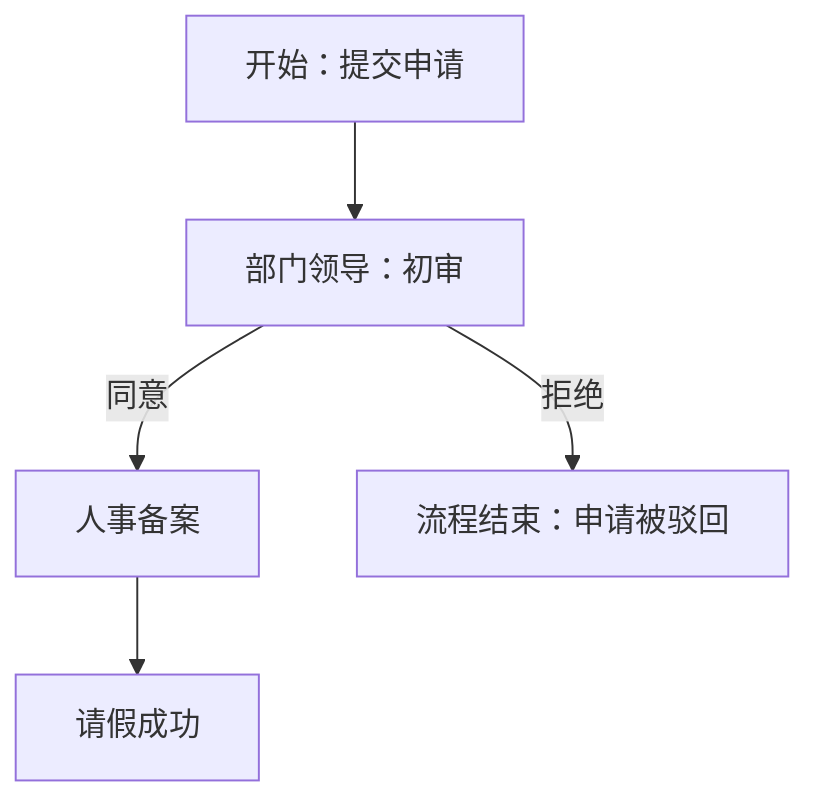

# Markdown 高级进阶技术手册

**整合课程 1~10 核心知识点 | 遵循语义化与排版规范**

[跳至文末](#手册结语)

## 课程 1：页内跳转 —— 长文档的 “传送门”

### 核心操作

1.  准备终点：确定目标标题（层级规范）
2.  设置起点：`[跳转文字](#目标标题)`，`#` 不可省略
3.  英文标题：空格替换为 `-` 并小写，如 `## My Tips` → `[查看](#my-tips)`

## 课程 2：脚注与注释 —— 像写书一样严谨

### 核心操作

1.  正文标注：需解释术语后加 `[^编号]`
2.  文末注释：`[^编号]: 详细解释内容`，编辑器自动渲染上标

### 作业实操

# 畅游空间电商传媒有限公司

## 公司简介
畅游空间成立于 2024 年，专注于为美妆、家电领域的品牌方提供 **坑位**[^1] 管理及直播间运营服务。我们通过精准的 **控评**[^2] 策略和高效的 **推流**[^3] 技术，确保每一场直播的 **GMV**[^4] 都能达到预期目标。

去年，我们成功助力某国货护肤品牌实现了单场 **纯佣模式**[^5] 下的千万级爆单。

**解释脚注**
[^1]: **坑位**：指直播间商品的固定展示位置。商家支付“坑位费”以获得在直播时段内展示商品的权利。
[^2]: **控评**：控制评论区的舆论走向。通过关键词屏蔽或人工引导，维护直播间的正向购物氛围。
[^3]: **推流**：主播将本地的视频和音频信号实时传输到电商平台服务器的技术过程，决定了直播的清晰度与流畅度。
[^4]: **GMV**: Gross Merchandise Volume，即成交总额。包含付款和未付款的所有订单金额。
[^5]: **纯佣模式**：一种合作方式，主播不收取固定坑位费，仅根据最终的销售额抽取一定比例的佣金提成。

## 课程 3：数学公式（基础篇）—— 理工科的刚需

### 核心操作

1.  行内公式：一对 `$` 包裹，嵌入文本
2.  独立块公式：两对 `$$` 包裹，单独成行
3.  符号规则：`^` 代表次方，`_` 代表下标

### 作业实操

1.  行内公式：圆的面积计算公式为 S=πr2
2.  独立块公式：
    
    S=πr2

## 课程 4：HTML 增强 —— 突破 Markdown 的极限

### 核心操作

1.  文字改色：`目标文字`
2.  文字居中：`
目标文字
`
3.  使用原则：仅 Markdown 无法实现时使用，不滥用

### 作业实操

# 
幼小衔接准备清单

## 一、生活习惯准备

-   早睡早起：建立与小学同步的作息时间表。
-   独立进餐：能够自己收拾餐具，不挑食。

## 二、 心理与能力准备
家长需要多带孩子参观小学校园，消除对未知环境的恐惧感。在交流过程中，培养孩子的安全意识 $\color{red}{\text{极其重要}}$ ，必须教会孩子记住家长的电话号码。

## 三、文具准备清单

-   双肩书包（轻便护脊）
-   铅笔盒（功能简单，避免分心）
-   姓名贴（贴在所有个人物品上）

陪伴孩子迈出成长第一步

## 课程 5：Emoji 魔力 —— 让文档有温度

### 核心操作

1.  输入格式：`:emoji英文单词:`
2.  查询技巧：`gitmoji.dev` 查找图标含义
3.  使用原则：适度添加，缓解纯文字枯燥

### 作业实操

# :memo:幼小衔接·成长打卡

## :triangular_flag_on_post:今日时间表
- 用括号中的图标表示进度（:white_check_mark: 完成  、:hourglass_flowing_sand: 进行中、 :x: 未开始）

|完成进度|任务明细|
|---|---|
|07:30自己穿衣服、刷牙洗脸|:white_check_mark:| 
|09:00幼小衔接识字练习|:white_check_mark:|
|16:00户外运动 1 小时|:hourglass_flowing_sand:|

## 课程 6：Mermaid 绘图（流程图）—— 告别截图

### 核心操作

1.  代码块声明：开头标注 `mermaid`
2.  绘图方向：`LR`（从左到右）、`TD`（从上到下）
3.  箭头绘制：`A --> B`（基础）、`A -- 备注 --> B`（带说明）

### 作业实操

# 请假审批流程图

## 课程 7：特殊符号转义 —— 当符号撞车时

### 核心操作

1.  转义规则：特殊符号前加反斜杠 `\`
2.  支持符号：`*`、`#`、`_`、`[]`、`{}` 等
3.  注意事项：反斜杠紧贴符号，无空格

### 作业实操

** 这段文字两边有星号，但它不加粗 **

## 课程 8：任务列表与协作 —— 管理你的进度

### 核心操作

1.  已完成：`- [x] 任务内容`
2.  未完成：`- [ ] 任务内容`
3.  关键要求：中括号**两侧必须留空格**

### 作业实操

# 本周学习进度管理

-   **Markdown 高阶语法**：Mermaid 绘图、特殊符号转义、任务列表与协作。
-   **Markdown 高阶语法**：相对路径与图床、语义化与排版规范。
-   **Git 基础实操**：仓库克隆、代码提交、远程仓库推送。

## 课程 9：相对路径与图床 —— 让图片永不丢失

### 核心操作

1.  文件夹创建：仓库根目录建 `images` 文件夹
2.  相对引用：``
3.  核心标识：`./` 代表**当前文件夹**，不可省略

### 作业实操
疯狂动物城图片展示：
  

## 课程 10：语义化与排版规范 —— 从码农到专家

### 核心规范

1.  **中英文 / 数字空格**：中文与英文、数字之间加 1 个空格（如：课程 10、2024 年、GitHub 仓库）
2.  **段落 / 标题留白**：所有标题（`#`/`##`/`###`）前后必须留空行，模块间用空行分隔
3.  **标题层级**：严格遵循「# 一级 → ## 二级 → ### 三级」，禁止跳级
4.  **通用原则**：代码块、公式、流程图与文本间留空行，提升可读性

## 手册结语

本手册完整整合 Markdown 高级进阶 10 课核心知识点与实操作业，全程遵循课程 10 语义化排版规范，实现从 “写得对” 到 “写得美” 的进阶，可作为日常使用 Markdown 的实用参考手册。

[回到顶部]( #markdown-高级进阶技术手册)
